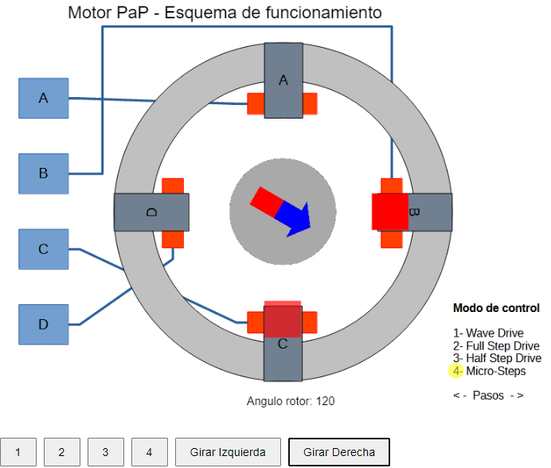

# Stepper Motor Simulation

This project is a simulation of a stepper motor using p5.js. The simulation demonstrates basic stepper motor control, where users can interact with the motor using keyboard keys or on-screen buttons. 
The motor's stator is a fixed background image, while the rotor, which rotates in the center, is another image with alpha transparency.



## Features

- **Interactive Control**: Rotate the motor by pressing the left and right arrow keys or by using on-screen buttons for touch devices.
- **Multiple Modes**: The motor can operate in four different modes, which can be switched using the keyboard keys 'a', 'b', 'c', and 'd' or corresponding buttons on the screen:
  - **Mode 1**: Full step sequence with energizing single and paired windings.
  - **Mode 2**: Single step sequence energizing single windings only.
  - **Mode 3**: Two-phase step sequence energizing pairs of opposite windings.
  - **Mode 4**: Micro-step sequence where the rotor moves in 15-degree steps and the winding intensities gradually change.

## Instructions

- **Keyboard Controls**:
  - Use the left arrow key to rotate the motor counterclockwise.
  - Use the right arrow key to rotate the motor clockwise.
  - Press 'a', 'b', 'c', or 'd' to switch between the four modes.
  
- **Touch Controls**:
  - On-screen buttons to rotate the motor left or right.
  - On-screen buttons to switch between modes.

## Installation and Setup

1. Clone the repository:
   ```sh
   git clone https://github.com/yourusername/stepper-motor-simulation.git
   ```
2. Navigate to the project directory:
   ```sh
   cd stepper-motor-simulation
   ```
3. Open the `index.html` file in your web browser to run the simulation.

## Usage

- **Running the Simulation**: Simply open the `index.html` file in any modern web browser to start the simulation.
- **Interacting with the Simulation**: Use the keyboard or on-screen buttons to control the motor's rotation and switch between different operating modes.

## Demo

You can see a live demo of the simulation [here]((https://lisandro-lanfranco.github.io/motor-pap/index.html)).

## Contributing

Contributions are welcome! Please fork the repository and create a pull request with your changes. Ensure your code follows the existing style and structure of the project.

---

## Acknowledgements
This project was developed by Ing. Lisandro Lanfranco for the Laboratory of Animatronics and Dynamic Control - UNC.
